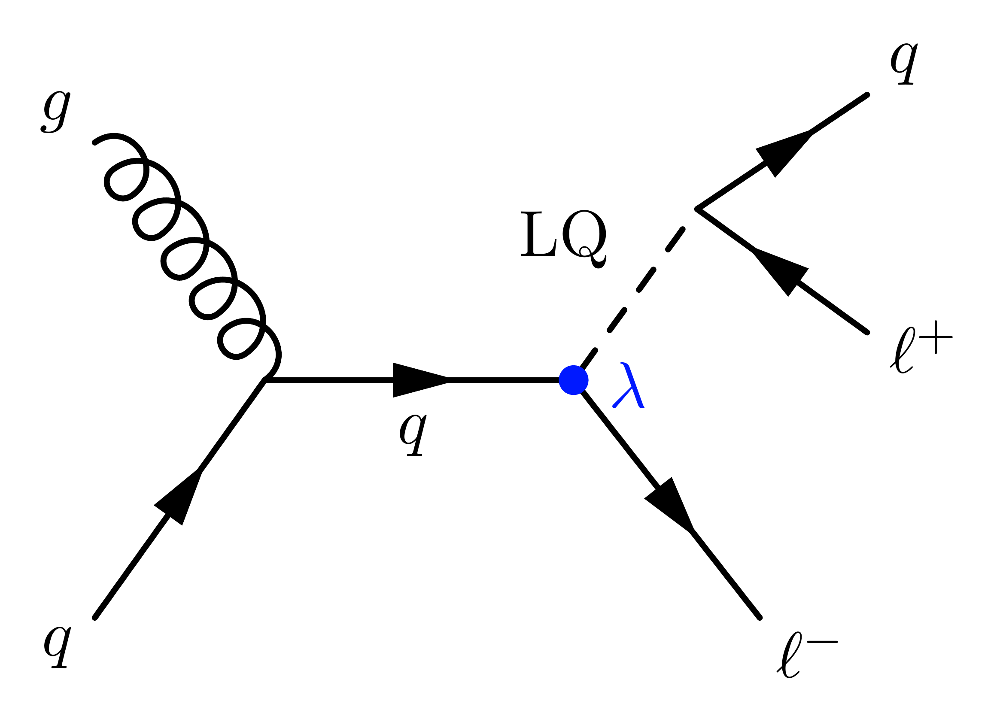

# Leptoquark Object Selection
This codebase is part of a search at the Compact Muon Solenoid for a leptoquark decaying to a muon and a b-jet.

Gluon induced Leptoquark production

This single leptoquark process has three final state particles:
1. A b-jet from the leptoquark decay
2. A muon from the leptoquark decay
3. An "initial state" muon created to conserve lepton number

The kinematics of these three objects are the primary discriminating variables available for distinguishing signal and background. As such, the sensitivity of the search is dependent on how reliably these objects are correctly identified. This codebase is for training and testing algorithms to perform this identification.

Steps:

0. Change the paths in config.py
1. ground_truth.py uses generator level information to determine the true LQ-muon, LQ-jet, and initial state muon. analysis.py plots some kinematics to help inform the classification strategy
2. train.py trains and tests a model on the ground-truth tagged data. plot_performance.py plots the performance of these algorithms
3. run_selection.py adds classification branches to a root file with the indices of the predicted LQ-muon, LQ-jet, and initial state muon

New classification algorithms should be added to Classifier.py and extend the Classifier class.
